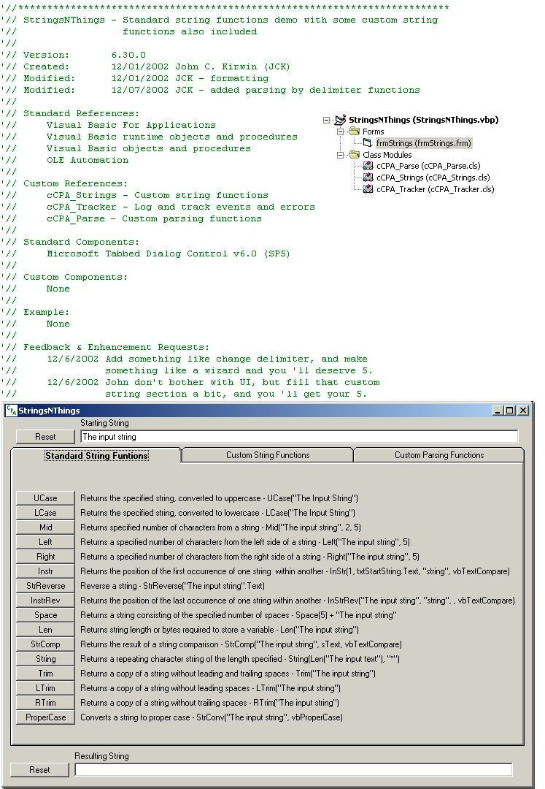



## StringsNThings

### Description

Demonstration project of standard Visual Basic string functions with some custom string functions also included.
 
### More Info
 
Standard References:

Visual Basic For Applications

Visual Basic runtime objects and procedures

Visual Basic objects and procedures

OLE Automation

Standard Components:

Microsoft Tabbed Dialog Control v6.0 (SP5)

             |
---                |---
**Submitted On**   |2002-12-08 22:25:34
**By**             |[John C Kirwin](https://github.com/Planet-Source-Code/PSCIndex/blob/master/ByAuthor/john-c-kirwin.md)
**Level**          |Intermediate
**User Rating**    |4.4 (71 globes from 16 users)
**Compatibility**  |VB 6\.0
**Category**       |[String Manipulation](https://github.com/Planet-Source-Code/PSCIndex/blob/master/ByCategory/string-manipulation__1-5.md)
**World**          |[Visual Basic](https://github.com/Planet-Source-Code/PSCIndex/blob/master/ByWorld/visual-basic.md)
**Archive File**   |[StringsNTh1510221292002\.zip](https://github.com/Planet-Source-Code/john-c-kirwin-stringsnthings__1-41214/archive/master.zip)

